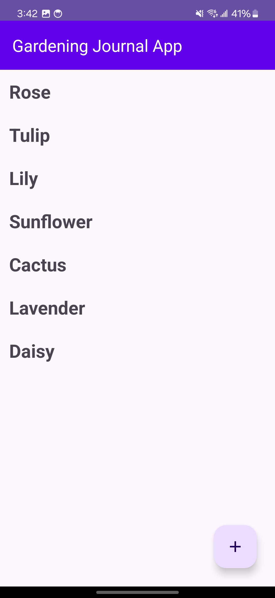
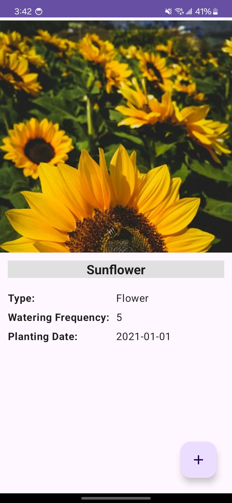
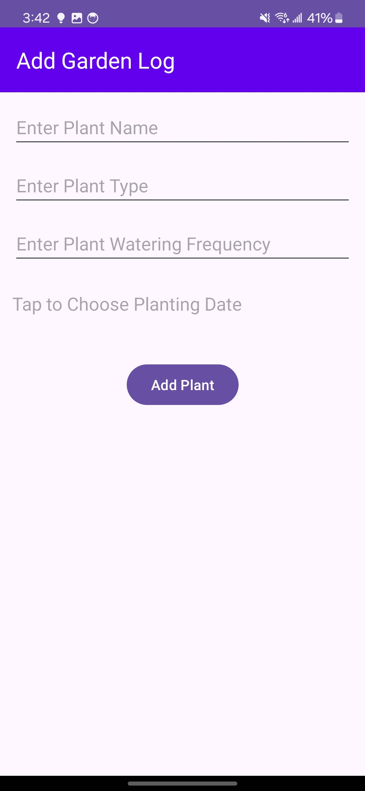

# Gardening Journal App

This is a gardening journal application that lets the user keep track of the plants that they
water and type of the plants that they have. The user can also see the date on which the plant was
planted.
This lets the user keep track of the plants that they have and the plants that they want to plant in
the future.

## Screenshots

### Plant List (HomeScreen)

 

### Plant Details Screen (PlantDetailsScreen)

 

 

### Garden Log Screen (GardenLogScreen)

 

## How to Setup Android Studio

1. If you don't have Android Studio installed, you can download it from the official website:
   https://developer.android.com/studio/install
2. Run an empty project to make sure everything is setup properly.

## How to run and build the app

1. Clone the repository.
2. Make sure you have Java, Android SDK and Android Studio installed and setup properly. (refer to
   android studio link above if not setup properly)
2. After opening the project in Android Studio, sync so all the dependencies can be fetched after
   which the project should be ready to run.
3. Run the app module to install the application on your device. or run the gradle task "./gradlew
   assembleDebug" to assmeble the application.
4. After the module is built, the app should be ready to run and explore.

 
 

## Libraries used for the application:

1. [Room](https://developer.android.com/jetpack/androidx/releases/room) - Used for local database
   storage.
2. [Navigation](https://developer.android.com/jetpack/androidx/releases/navigation) - Used for
   navigation between fragments.
3. [Lifecycle](https://developer.android.com/jetpack/androidx/releases/lifecycle) - Used for
   lifecycle aware components.
4. [Material](https://material.io/develop/android/docs/getting-started/) - Used for material design
   components.
5. [Coil](https://coil-kt.github.io/coil/getting_started/) - Used for image loading.
6. [Hilt](https://developer.android.com/training/dependency-injection/hilt-android) - Used for
   dependency injection.
    7. [Coroutines](https://developer.android.com/kotlin/coroutines) - Used for asynchronous
       programming.
8. [ViewModel](https://developer.android.com/topic/libraries/architecture/viewmodel) - Used for
   storing and managing UI-related data.
9. [LiveData](https://developer.android.com/topic/libraries/architecture/livedata) - Used for
   observable data holder.
10. [Jetpack Compose](https://developer.android.com/jetpack/compose) - Used for building UI.